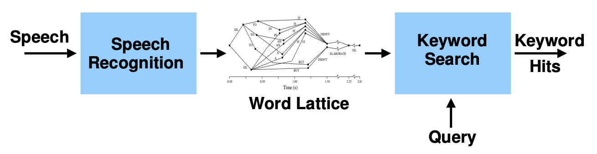

# Keyword Spotting for ASR systems

Tony Wu, tw581@cam.ac.uk

## About this project

One interesting application of speech technology is the detection of a particular word, or phrase, in a stream of audio. Most state-of-the-art speech keyword spotting (KWS) systems make use of large vocabulary speech recognition systems to generate lattice which are then used in the KWS process. Efficiency, OOV queries, and threshold selection are the 3 major criteria for evaluating a KWS solution.

**Note:** While this work was only experimented on 1-best outputs, it is compatible with a lattice output too.

**Note 2:** Keyword spotting is not intended to be run on the fly but on a large number of pre-generated inputs. If the user is interested in creating a voice assistant that detects a certain wake sequence of words, he/she should use an audio classification model instead. See https://huggingface.co/learn/audio-course/chapter7/voice-assistant for a neat guide on this subject.

## Methodology

- Morphological decomposition → to break down words or phrases into morphemes and to tackle  OOVs
- Score normalization → normalize the ASR output scores with respect to the current hit sequence
- Grapheme confusion → the idea is to handle each OOV word by replacing it with the closest IV word with respect to the weighted Levenshtein distance. The weights used here are a function of the frequencies of all grapheme confusions.

## Results

| #    | System                                                       | TWV All   | TWV In-vocabulary (TWV IV) | TWV Out-of-vocabulary (TWV OOV) | PFA (probability of false alarm) | PM (probability of missing) | Dec. Tresh |
| ---- | ------------------------------------------------------------ | --------- | -------------------------- | ------------------------------- | -------------------------------- | --------------------------- | ---------- |
| 1    | `decode.ctm` (base)                                          | 0.319     | 0.401                      | 0.000                           | **0.00002**                      | 0.663                       | 0.0425     |
| 2    | `decode-morph.ctm` (morph-based system)                      | 0.317     | 0.381                      | **0.068**                       | 0.00003                          | 0.651                       | 0.0373     |
| 3    | `decode-morph-custom.ctm` (base+mapping)                     | 0.311     | 0.387                      | 0.018                           | 0.00004                          | 0.652                       | 0.0370     |
| 4    | `decode.ctm` (base + score normalization)                    | 0.320     | 0.402                      | 0.000                           | **0.00002**                      | 0.663                       | 0.0074     |
| 5    | `decode-morph.ctm` (morph-based system + score normalization) | 0.325     | 0.391                      | **0.068**                       | 0.00003                          | 0.651                       | 0.0040     |
| 6    | `decode-morph-custom.ctm` (base+mapping + score normalization) | 0.316     | 0.393                      | 0.018                           | 0.00004                          | 0.662                       | 0.0040     |
| 7    | `decode.ctm` (base + grapheme confusion)                     | 0.269     | 0.346                      | -0.028                          | 0.00011                          | **0.623**                   | 0.0425     |
| 8    | `decode-morph.ctm.ctm` (base + grapheme confusion)           | 0.285     | 0.342                      | 0.064                           | 0.00007                          | 0.649                       | 0.0076     |
| 9    | `decode-morph.ctm.ctm` (base + grapheme confusion + score normalization) | 0.323     | 0.389                      | 0.067                           | 0.00007                          | 0.649                       | 0.0007     |
| 10   | `decode.ctm` (base + grapheme confusion + score normalization) | **0.337** | **0.407**                  | 0.067                           | 0.00011                          | **0.623**                   | 0.0006     |

 <b>Table 4: Keyword spotting results comparing index search with base configuration, morphological decomposition, score normalization and grapheme confusion. Best result for each metric is highlighted.</b>

**Observations:**

- Combining morphological decomposition and grapheme confusion is redundant. Even worse, it actually makes the system less performant in general (see system #8 which achieves the worst TWV All score of all systems).
- The best system with respect to TWV All is system #10 with grapheme confusion and score normalization  with a score of $0.337$. It is also the model with the lowest probability of missing ($PM = 0.623$). The fact that this system misses more words comes from the fact that grapheme confusion can only output words from the IV set: this bias seems to guide the system in the correct direction.

## Full report

Open `report.pdf` for the full report.

## Acknowledgments

This project is part of a coursework for the MLMI14 course of the Cambridge MPhil in Machine Learning and Machine Intelligence. All the code pushed in the [1st commit](https://github.com/tonywu71/keyword_spotting/commit/439fe253b61b5c7bb4c94ffebf34ca5dfd4b94ab) is not mine and thus belongs to the authors of the code. On the other hand, all the Python code has been coded from scratch and is thus mine.